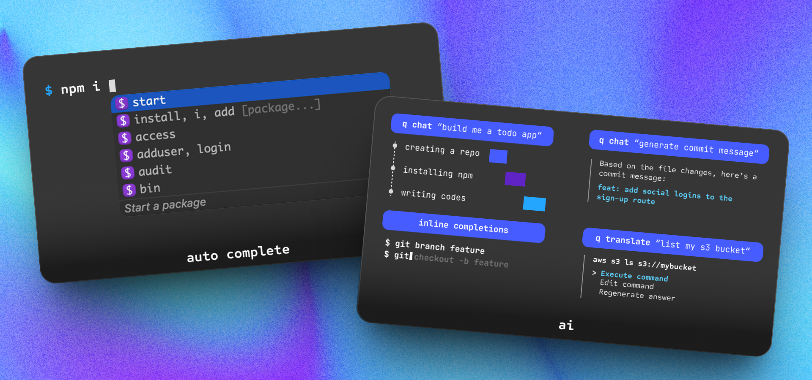

<p align="center">
  <a href="https://docs.aws.amazon.com/amazonq/latest/qdeveloper-ug/command-line-installing.html">
    <picture>
      
    </picture>
  </a>
</p>

<h4 align="center">
  Amazon Q CLI brings IDE-style autocomplete and agentic capabilities to your terminal.
</h4>


<div align="center">
  <a href="https://github.com/aws/amazon-q-developer-cli/graphs/commit-activity"></a>
  <a href="https://github.com/aws/amazon-q-developer-cli/issues"></a>
</div>


<div align="center">

[](https://github.com/aws/amazon-q-developer-cli/actions/workflows/rust.yml)
[](https://github.com/aws/amazon-q-developer-cli/actions/workflows/typos.yml)
[](https://github.com/aws/amazon-q-developer-cli/actions/workflows/typescript.yml)
</div>

<p align="center">
  <a href="https://docs.aws.amazon.com/amazonq/latest/qdeveloper-ug/command-line-installing.html">
    <picture>
      
    </picture>
  </a>
</p>

## 😍 Features
-   🔮 [**Auto Completion**](https://docs.aws.amazon.com/amazonq/latest/qdeveloper-ug/command-line-autocomplete.html): IDE-style completions to hundreds of popular CLIs like `git`, `npm`, `docker`, and `aws`.
-   💬 [**Natural Language Chat**](https://docs.aws.amazon.com/amazonq/latest/qdeveloper-ug/command-line-chat.html): Interact with your terminal using natural language to ask questions, debug issues, or explore the codebase.
-   🧠 [**Contextual Awareness**](https://docs.aws.amazon.com/amazonq/latest/qdeveloper-ug/command-line-chat.html#command-line-chat-context-integration): Integrates context from your local development environment, so answers are tailored to your specific code and setup.
-   🤖 [**Agentic Execution**](https://docs.aws.amazon.com/amazonq/latest/qdeveloper-ug/command-line-autocomplete.html): Let Amazon Q take action: generate code, edit files, automate Git workflows, resolve merge conflicts, and more — with your permission.

## ⚡️ Installation

- **macOS**:
  - **DMG**: Download from AWS:
    [aws.amazon.com](https://docs.aws.amazon.com/amazonq/latest/qdeveloper-ug/command-line-getting-started-installing.html)
  - **Homebrew**: `brew install amazon-q`
- **Linux**:
  - [Ubuntu/Debian](https://docs.aws.amazon.com/amazonq/latest/qdeveloper-ug/command-line-installing.html#command-line-installing-ubuntu)
  - [AppImage](https://docs.aws.amazon.com/amazonq/latest/qdeveloper-ug/command-line-installing.html#command-line-installing-appimage)
  - [Alternative Linux builds](https://docs.aws.amazon.com/amazonq/latest/qdeveloper-ug/command-line-installing.html#command-line-installing-alternative-linux)
- **Windows**:
  - Follow the discussions for
    [Windows](https://github.com/aws/q-command-line-discussions/discussions/15)
  - Or [use it on Windows with WSL](https://docs.aws.amazon.com/amazonq/latest/qdeveloper-ug/command-line-installing.html#command-line-installing-windows)
- **Remote machines**
  - [Autocomplete in SSH](https://docs.aws.amazon.com/amazonq/latest/qdeveloper-ug/command-line-autocomplete-ssh.html)


## 🚀 Start Contributing

### Prerequisites

- MacOS
  - Xcode 13 or later
  - Brew

### 1. Clone repo

```shell
git clone https://github.com/aws/amazon-q-for-command-line.git
```

### 2. Setup
Hassle-free setup:
```shell
npm run setup
```

Or if you'd like to DIY:

<details>
<summary>Manual Setup</summary>
<div>

### 1. Install platform dependencies

For Debian/Ubuntu:

```shell
sudo apt update
sudo apt install build-essential pkg-config jq dpkg curl wget cmake clang libssl-dev libgtk-3-dev libayatana-appindicator3-dev librsvg2-dev libdbus-1-dev libwebkit2gtk-4.1-dev libjavascriptcoregtk-4.1-dev valac libibus-1.0-dev libglib2.0-dev sqlite3 libxdo-dev protobuf-compiler
```
### 2. Install Rust toolchain using [Rustup](https://rustup.rs):

```shell
curl --proto '=https' --tlsv1.2 -sSf https://sh.rustup.rs | sh
rustup default stable
```

For pre-commit hooks, the following commands are required:

```shell
rustup toolchain install nightly
cargo install typos-cli
```

For MacOS development make sure the right targets are installed:

```shell
rustup target add x86_64-apple-darwin
rustup target add aarch64-apple-darwin
```

### 3. Setup Python and Node using [`mise`](https://mise.jdx.dev)

Add mise integrations to your shell:

For zsh:
```shell
echo 'eval "$(mise activate zsh)"' >> "${ZDOTDIR-$HOME}/.zshrc"
```

For bash:
```shell
echo 'eval "$(mise activate bash)"' >> ~/.bashrc
```

For fish:
```shell
echo 'mise activate fish | source' >> ~/.config/fish/config.fish
```

Install the Python and Node toolchains using:

```shell
mise trust
mise install
```

### 4. Setup precommit hooks

Run `pnpm` in root directory to add pre-commit hooks:

```shell
pnpm install --ignore-scripts
```

</div>
</details>


### 3. Start Local Development
To compile and view changes made to `q chat`:
```shell
cargo run --bin q_cli -- chat
```

> If you are working on other q commands, just replace `chat` with the command name 

To run tests for the Q CLI crate:
```shell
cargo test -p q_cli
```

To format Rust files:
```shell
cargo +nightly fmt
```

To run clippy:
```shell
cargo clippy --locked --workspace --color always -- -D warnings
```


### 💡 Quick Tip for Onboarding

Use Q CLI to help you onboard Q CLI! 

Start a `q chat` session:

```shell
q chat
```

Once inside `q chat`, you can supply project context by adding the [`codebase-summary.md`](codebase-summary.md) file:

```shell
/context add codebase-summary.md
```

This enables Q to answer onboarding questions like:

- “What does this crate do?”

- “Where is X implemented?”

- “How do these components interact?”

Great for speeding up your ramp-up and navigating the repo more effectively.


## 🏗️ Project Layout

Several projects live here:

- [`autocomplete`](packages/autocomplete/) - The autocomplete react app
- [`dashboard`](packages/dashboard-app/) - The dashboard react app
- [`figterm`](crates/figterm/) - figterm, our headless terminal/pseudoterminal that
  intercepts the user’s terminal edit buffer.
- [`q_cli`](crates/q_cli/) - the `q` CLI, allows users to interface with Amazon Q Developer from
  the command line
- [`fig_desktop`](crates/fig_desktop/) - the Rust desktop app, uses
  [`tao`](https://docs.rs/tao/latest/tao/)/[`wry`](https://docs.rs/wry/latest/wry/)
  for windowing/webviews
- [`fig_input_method`](crates/fig_input_method/) - The input method used to get cursor
  position on macOS
- [`vscode`](extensions/vscode/) - Contains the VSCode plugin needed
  for the Amazon Q Developer for command line to work in VSCode
- [`jetbrains`](extensions/jetbrains/) - Contains the VSCode plugin
  needed for the Amazon Q Developer for command line to work in Jetbrains IDEs

Other folder to be aware of

- [`build-scripts/`](build-scripts/) - Contains all python scripts to build,
  sign, and test the project on macOS and Linux
- [`crates/`](crates/) - Contains all internal rust crates
- [`packages/`](packages/) - Contains all internal npm packages
- [`proto/`](proto/) -
  [protocol buffer](https://developers.google.com/protocol-buffers/) message
  specification for inter-process communication
- [`tests/`](tests/) - Contain integration tests for the projects

Below is a high level architecture of how the different components of the app and
their IPC:




## 🛡️ Security

See [CONTRIBUTING](CONTRIBUTING.md#security-issue-notifications) for more information.

## 📜 Licensing

This repo is dual licensed under MIT and Apache 2.0 licenses.

“Amazon Web Services” and all related marks, including logos, graphic designs, and service names, are trademarks or trade dress of AWS in the U.S. and other countries. AWS’s trademarks and trade dress may not be used in connection with any product or service that is not AWS’s, in any manner that is likely to cause confusion among customers, or in any manner that disparages or discredits AWS.
