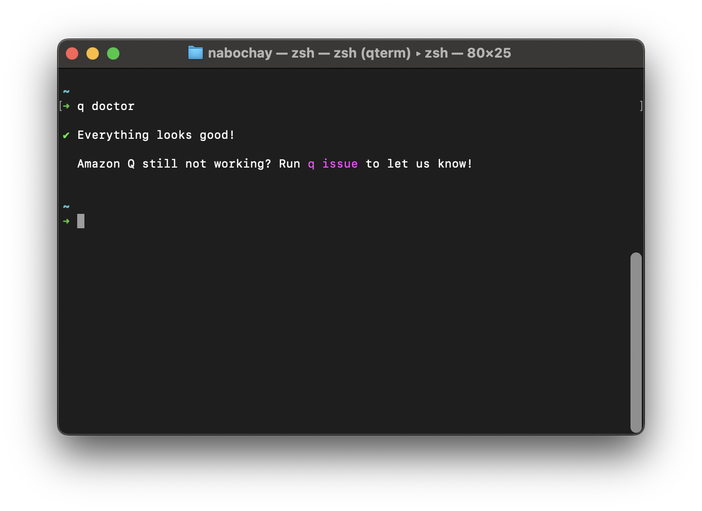
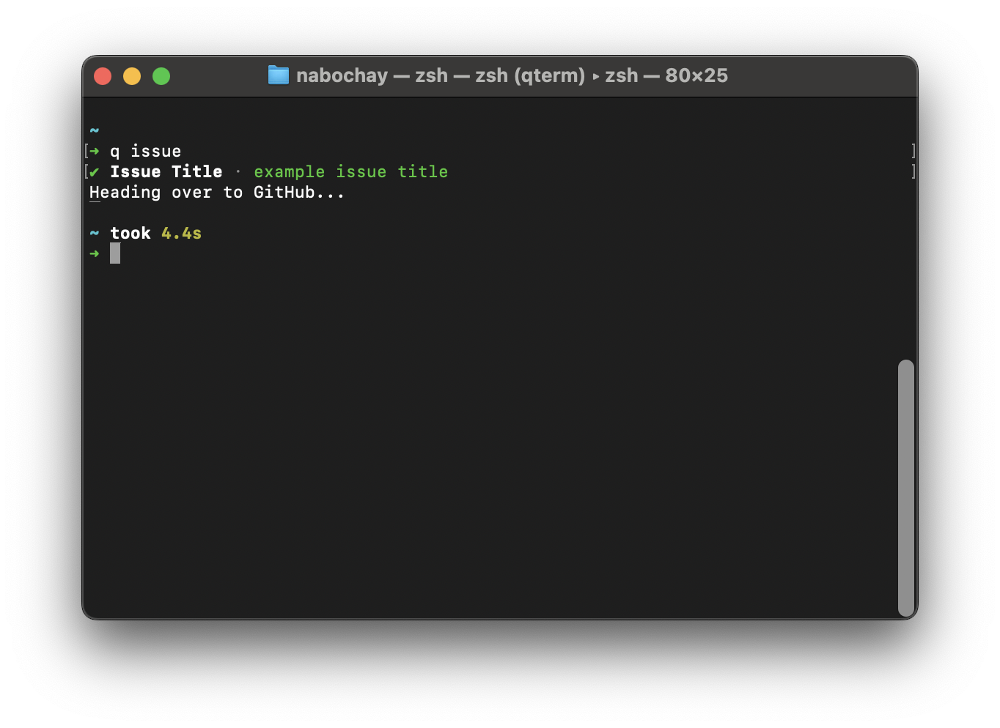

# Support and feature requests

## Support

> If you have a security related issue or concern, please report it using the [vulnerability reporting page](https://aws.amazon.com/security/vulnerability-reporting/) or by emailing aws-security@amazon.com. Do **not** follow the guidance on this page.

The first thing to try before reaching out is to run `q doctor`.

`q doctor` will first attempt to autoresolve issues when possible and alert you when it can't. When successful, doctor will display the output below.

If doctor fails to resolve your issue, the next thing to try is to create an issue by running `q issue`.

`q issue` will prefill diagnostic info and direct you to our issue template to submit. These items are reviewed by the support and service teams weekly.

If for some reason `q` is not on your path you will need to [create an issue manually](https://github.com/aws/q-cli/issues).

If your issue is causing problems with your machine, run `q uninstall`.

`q uninstall` will uninstall Amazon Q entirely.

## Feature requests

For feature requests, please create a discussion [here](https://github.com/aws/q-cli/discussions). Discussions are voted on by the community and triaged quarterly.
