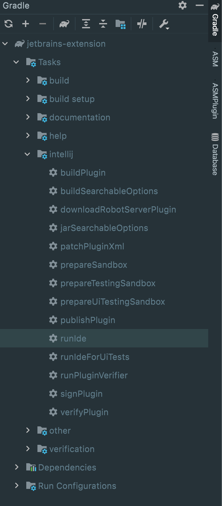

# Fig Jetbrains Extension

This project uses [Gradle](https://gradle.org/) as a package manager and a builder/runner.

## How it works
The extension registers a [service](src/main/java/io/fig/jetbrains/FigService.java) which keeps track of the current terminals.

A [ToolWindowManager listener](src/main/java/io/fig/jetbrains/FigWindowListener.java) is also registered, which allows us to get the ContentManager of the terminal ToolWindow.

This ContentManager is used through two [ITerminalEntry](src/main/java/io/fig/jetbrains/entries/ITerminalEntry.java):
- [ExistingTerminalsEntry](src/main/java/io/fig/jetbrains/entries/impl/ExistingTerminalsEntry.java) fetch the currently opened terminals and send me to the service
- [ListenTerminalsEntry](src/main/java/io/fig/jetbrains/entries/impl/ListenTerminalsEntry.java) listen for creating or deleting terminals and also send them to the service

The service finally handles those two entries and processes the logic to run the right commands at the right moment.

## Setup
1. Clone this repo and import it to your IDE as a **Gradle** project.
2. Run the plugin in a test IDE using `./gradlew runIde` (or `.\gradlew.bat runIde` on Windows)
> Note: you may need to run `./gradlew clean` before this, or the plugin will be marked as incompatible with your IDE.
3. Build the plugin using `./gradlew buildPlugin` (or `.\gradlew.bat buildPlugin` on Windows)
4. You can see all tasks with `./gradlew tasks` (or `.\gradlew.bat tasks` on Windows)

You can also run the tasks directly inside IntelliJ IDEA, in the Gradle panel:

